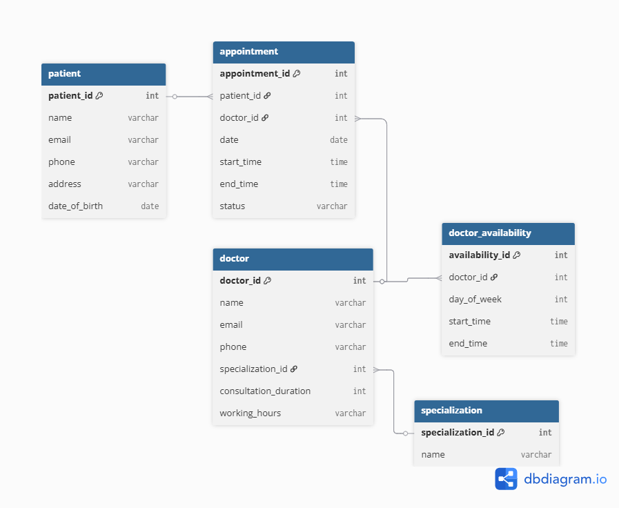

# 📘 Hospital Appointment Scheduler

## 📑 Table of Contents
- [📌 Project Overview](#-project-overview)
- [🧠 Tech Stack](#-tech-stack)
- [🚀 Features](#-features)
- [📁 Project Structure](#-project-structure)
- [🛠️ Setup & Run Instructions](#️-setup--run-instructions)
- [🗄️ Database Schema (ERD)](#️-database-schema-erd)
- [📡 API Endpoints](#-api-endpoints)
- [🧪 Running Tests](#-running-tests)
- [🐳 Docker Commands](#-docker-commands)
- [📜 Access Database from Docker](#-access-database-from-docker)

## 📌 Project Overview

This is a **Node.js backend application** for managing hospital appointments, patients, doctors, and scheduling.  
It was built as part of the **Node.js-2025-01 Personal Project** and implements:

- ✅ User authentication (built from scratch)
- ✅ PostgreSQL database with complete schema and relationships
- ✅ Docker containerization for one-command startup
- ✅ Redis integration for session management
- ✅ REST API for user registration, login, logout, and protected routes
- ✅ Unit tests with >50% coverage

---

## 🧠 Tech Stack

- **Node.js** – Backend runtime
- **Express.js** – Web framework
- **PostgreSQL** – Main relational database
- **Redis** – Session and cache storage
- **Docker & Docker Compose** – Container orchestration
- **bcrypt** – Password hashing
- **pg** – PostgreSQL client
- **UUID** – Session token generation
- **Jest + Supertest** – Unit testing

---

## 🚀 Features

- 👤 **Custom Authentication** – Register, login, logout with hashed passwords
- 🔑 **Session Tokens (JWT-like)** – Generated manually and stored in Redis
- 🩺 **Hospital Domain** – Patients, doctors, appointments, availability
- 📅 **Scheduling Logic** – Prevents overlapping appointments
- 🐳 **One-Command Startup** – Everything runs with `docker compose up --build`
- 🧪 **Unit Tests** – Coverage > 80%

---

## 📁 Project Structure
```
personal_project_1/
├─ src/
│ ├─ routes/
│ ├─ middleware/
│ ├─ services/
│ └─ app.js
├─ db/
│ ├─ schema.sql
│ └─ init.js
├─ tests/
├─ Dockerfile
├─ docker-compose.yml
├─ package.json
└─ docs/
  └─ rd-diagram.png
```

## 🛠️ Setup & Run Instructions

### 1. Clone the repository

```bash
git clone https://github.com/pawelnowicki87/personal_project_1.git
cd personal_project_1
2. Create a .env file
Create a .env file in the root directory with the following variables:

env
POSTGRES_USER=postgres
POSTGRES_PASSWORD=secret
POSTGRES_DB=hospital_db
POSTGRES_HOST=db
POSTGRES_PORT=5432

REDIS_HOST=redis
REDIS_PORT=6379

3. Start the project with Docker
bash
docker compose up --build

✅ This will start:
PostgreSQL database
Redis server
Node.js Backend

Backend will be available at:
👉 http://localhost:3000
```

## 🗄️ Database Schema (ERD)
Below is the entity-relationship diagram of the database:



🗃️ Database Tables Overview
Table	Description
users	Stores registered users (email, hashed password)
patient	Patient details (name, email, phone, etc.)
specialization	List of medical specializations
doctor	Doctors and their specialization
doctor_availability	Doctor weekly schedule
appointment	Appointment records with patient, doctor, and time

## 📡 API Endpoints

🔐 Authentication

1. Register a new user
POST /register
Request Body:
{
  "email": "john@example.com",
  "password": "mySecurePassword"
}
Response:
{
  "user": {
    "id": 1,
    "email": "john@example.com"
  }
}

2. Login
POST /login
Request Body:
{
  "email": "john@example.com",
  "password": "mySecurePassword"
}
Response:
{
  "token": "b6f7d8a2-2c6e-4d9e-93f5-79c1a6d4c3e1"
}

3. Logout
POST /logout

Headers:
Authorization: Bearer <token>
Response:
{
  "message": "Logged out"
}

4. Homepage (Protected)
GET /

Headers:
Authorization: Bearer <token>
Response:
{
  "message": "Hello user 1, welcome to homepage!"
}

## 🔐 Authentication Flow
Register – User is created with a hashed password

Login – Valid credentials return a session token

Access protected routes – Send Authorization: Bearer <token> header

Logout – Session is deleted from Redis

🧪 Running Tests
The project includes unit tests with Jest and Supertest.

▶️ Run tests inside Docker:
bash
docker exec -it hospital_backend npm test
✅ This will:

Run all tests

Generate a coverage report (/coverage/index.html)

Ensure database and Redis connections are active

Current coverage: ~81.25%

## 🐳 Docker Commands
Start project:
bash
docker compose up --build

Stop project:
bash
docker compose down --volumes

Inspect database tables:
bash
docker exec -it hospital_db psql -U postgres -d hospital_db -c "\dt"

Query data (example):
bash
docker exec -it hospital_db psql -U postgres -d hospital_db -c "SELECT * FROM users;"

## 📜 Access Database from Docker
You can connect to the PostgreSQL database running inside Docker directly:
bash
docker exec -it hospital_db psql -U postgres -d hospital_db

Then run SQL commands like:
sql
SELECT * FROM users;

Author: Paweł – Node.js Backend Developer (Solvd Laba 2025)